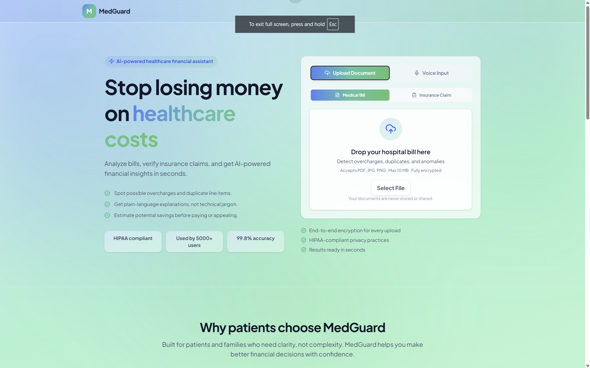
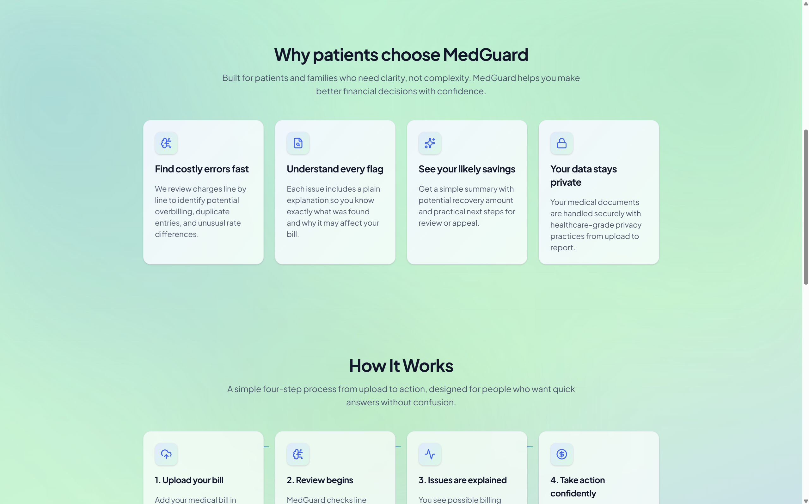
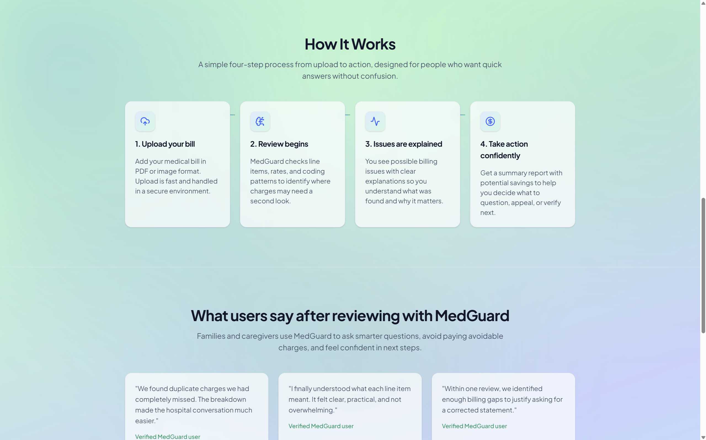
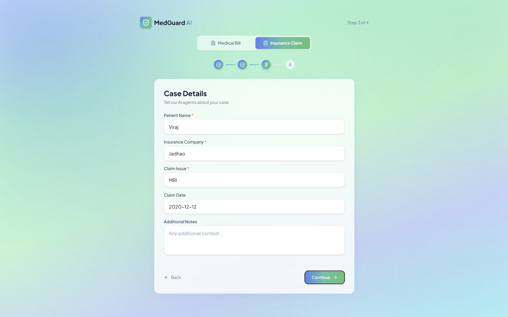
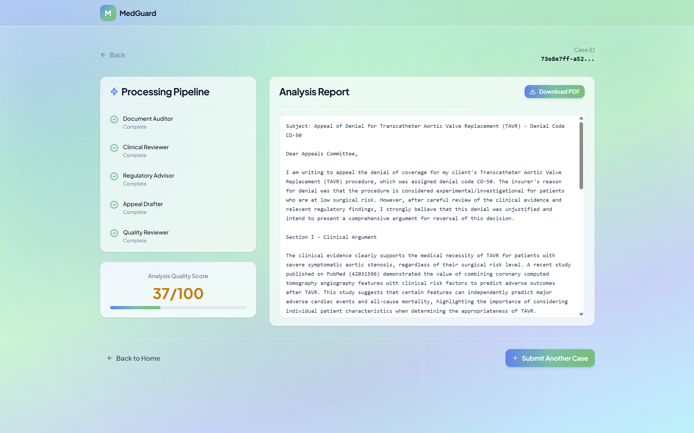

<div align="center">



# 🛡️ MedGuard AI

### AI-Powered Medical Billing Auditor & Insurance Appeal Engine for India

**67% of denied insurance claims are never appealed. We're making that number zero.**

[](https://fastapi.tiangolo.com/)
[](https://nextjs.org/)
[](https://www.python.org/)
[](https://www.typescriptlang.org/)
[](https://www.docker.com/)
[](https://github.com/pgvector/pgvector)
[](https://groq.com/)
[]()

*Built in 24 hours by **Viraj Jadhao** & **Bhumi Sirvi** — Team Neural Nomads @ Nexus 2.0*

</div>

---

## The Problem

A patient in Pune gets billed ₹2,200 for a procedure priced at ₹800 under CGHS norms. She has no way to know. She pays. This happens **8 million times a year** in India.

| Stat | Reality |
|---|---|
| 50 Crore insured Indians | Largest insured population in the world |
| 8M annual claim denials | Most go unchallenged |
| 67% never appealed | Because the process is too complex |
| ₹8K–₹15K average overcharge | Per bill, per patient |

No tool existed in India to fight this. **Until now.**

---

## What MedGuard Does

Upload your hospital bill. In **under 15 seconds**, MedGuard:

1. **Parses** every line item using OCR + LayoutLMv3
2. **Benchmarks** each charge against official CGHS government rates
3. **Flags** overcharges, duplicates, and anomalies with confidence scores
4. **Generates** a legally grounded, IRDAI-compliant insurance appeal letter — ready to send

No lawyer. No billing expert. No days of waiting. **15 seconds.**

---

## Screenshots

<table>
  <tr>
    <td><br/><sub><b>Home — Drag & drop bill upload</b></sub></td>
    <td><br/><sub><b>Why patients choose MedGuard</b></sub></td>
  </tr>
  <tr>
    <td><br/><sub><b>4-step appeal wizard — Step 1</b></sub></td>
    <td><br/><sub><b>4-step appeal wizard — Step 3: Case Details</b></sub></td>
  </tr>
  <tr>
    <td colspan="2"><br/><sub><b>Live pipeline view — All 5 agents complete, appeal letter generated, PDF ready to download</b></sub></td>
  </tr>
</table>

---

## The 5-Agent AI Pipeline

When a denial is submitted, five specialized AI agents execute sequentially. Every step streams live to the UI via Server-Sent Events.

```
Upload Denial + Policy PDF
         │
         ▼
┌───────────────────────┐
│  1. Document Auditor  │  Extracts denial reason, policy clauses, coverage gaps
└──────────┬────────────┘
           │
           ▼
┌────────────────────────┐
│  2. Clinical Reviewer  │  Finds medical necessity evidence, PubMed references
└───────────┬────────────┘
           │
           ▼
┌──────────────────┐
│  3. Regulatory   │  Searches IRDAI circulars + CGHS guidelines via RAG
│     Advisor      │  (vector store, no hallucinated citations)
└──────────┬───────┘
           │
           ▼
┌──────────────────────┐
│  4. Appeal Drafter   │  Writes formal, legally-sound appeal letter
│     (STREAMS LIVE)   │  Every token appears in real-time on screen
└──────────┬───────────┘
           │
           ▼
┌───────────────────────┐
│  5. Quality Reviewer  │  Scores appeal 0–100, polishes tone and structure
└──────────┬────────────┘
           │
           ▼
     📄 PDF Appeal Letter
     Ready to email or file
```

**Achieved latency: <15 seconds end-to-end** ✅

---

## System Architecture

```
┌─────────────────────────────────────────────────────────────────────┐
│                        MedGuard AI — Full Stack                     │
│                                                                     │
│  ┌─────────────────┐   HTTP + SSE    ┌──────────────────────────┐   │
│  │  Next.js 15     │◄───────────────►│  FastAPI Backend (v2.0)  │   │
│  │  TypeScript     │                 │  Unified entry: main.py  │   │
│  │  port 3000      │                 │  port 8000               │   │
│  └─────────────────┘                 └──────────┬───────────────┘   │
│                                                  │                  │
│                          ┌───────────────────────┼──────────────┐   │
│                          │                       │              │   │
│             ┌────────────▼──────┐  ┌─────────────▼──────┐  ┌───▼──┐ │
│             │  Bill Auditor     │  │  5-Agent AdvocAI   │  │ Auth │ │
│             │  • LayoutLMv3 OCR │  │  • Auditor         │  │ JWT  │ │
│             │  • CGHS Lookup    │  │  • Clinician       │  │bcrypt│ │
│             │  • Anomaly Detect │  │  • Regulatory      │  └──────┘ │
│             │  • PDF Generator  │  │  • Barrister (SSE) │           │
│             └───────────────────┘  │  • Judge (QA)      │           │
│                                    └────────────────────┘           │
│  ┌───────────────────────────────────────────────────────────────┐  │
│  │  PostgreSQL 16 + pgvector │ FAISS │ Docker Volumes │ Groq API │  │
│  └───────────────────────────────────────────────────────────────┘  │
└─────────────────────────────────────────────────────────────────────┘
```

---

## Tech Stack

### Backend
| Layer | Technology | Why |
|---|---|---|
| API Framework | FastAPI 0.115+ | Async-native, SSE streaming, auto docs |
| LLM | Groq API — LLaMA3-70B | Fastest inference available, free tier |
| OCR (PDFs) | PyMuPDF + LayoutLMv3 | Document-structure-aware parsing |
| OCR (Images) | EasyOCR | Handles photos of crumpled hospital bills |
| Embeddings / RAG | Sentence Transformers (all-MiniLM-L6-v2) | Grounds regulatory citations, no hallucinations |
| Vector Store | FAISS | In-memory, zero infra overhead |
| PDF Generation | ReportLab | Production-quality appeal PDF output |
| Database | PostgreSQL 16 + pgvector | Persistent, vector-search capable |
| Auth | PyJWT + bcrypt | Industry-standard, zero shortcuts |

### Frontend
| Layer | Technology | Why |
|---|---|---|
| Framework | Next.js 15 (App Router) | SSR, file-based routing, production-ready |
| Language | TypeScript 5 | Type safety across the entire codebase |
| Styling | Tailwind CSS v4 | Consistent, rapid UI |
| Animations | Framer Motion 12 | Live pipeline animations, streaming text |
| Real-time | Server-Sent Events | Token-by-token appeal streaming |

### Infrastructure
| Layer | Technology |
|---|---|
| Containerization | Docker + Docker Compose (3-service: db, backend, frontend) |
| Database | pgvector/pgvector:pg16 |
| File Persistence | Docker Volumes (survives restarts) |

---

## Key Technical Decisions

**Why FAISS over Pinecone?** Zero latency, zero cost, zero external dependency. The law library is small enough that in-memory vector search is faster than a network round-trip.

**Why Groq over OpenAI?** LLaMA3-70B on Groq produces tokens ~10x faster than GPT-4o at a fraction of the cost. This is what makes <15s possible.

**Why `temperature=0.2` for all agents?** Legal and medical documents need deterministic, professional language. Low temperature prevents creative hallucination in a domain where accuracy is everything.

**Why SSE over WebSockets?** One-directional streaming from server to client. No handshake overhead, works through every proxy, trivially simple to implement and debug.

---

## Database Schema

```sql
CREATE TABLE users (
    id SERIAL PRIMARY KEY,
    email TEXT UNIQUE NOT NULL,
    hashed_password TEXT NOT NULL,   -- bcrypt, never plaintext
    created_at TIMESTAMP DEFAULT NOW()
);

CREATE TABLE sessions (
    session_id UUID PRIMARY KEY,
    user_id INTEGER REFERENCES users(id),
    status TEXT DEFAULT 'queued',    -- queued | running | done | error
    patient_name TEXT,
    insurer_name TEXT,
    procedure_denied TEXT,
    denial_path TEXT,
    policy_path TEXT,
    created_at TIMESTAMP DEFAULT NOW(),
    updated_at TIMESTAMP DEFAULT NOW()
);

CREATE TABLE agent_outputs (
    id SERIAL PRIMARY KEY,
    session_id UUID REFERENCES sessions(session_id),
    agent_stage TEXT,                -- auditor|clinician|regulatory|barrister|judge
    output_json JSONB,
    created_at TIMESTAMP DEFAULT NOW()
);
```

---

## API Reference

### Bill Auditing
| Method | Endpoint | Description |
|---|---|---|
| `POST` | `/api/upload` | Upload bill → returns overcharges + savings estimate |
| `POST` | `/api/generate-appeal` | Quick appeal from last audit |
| `GET` | `/api/download-appeal/{filename}` | Download generated appeal |

**Upload response:**
```json
{
  "overcharges": [
    {
      "item": "Complete Blood Count",
      "charged": 850.0,
      "cghs_rate": 320.0,
      "overcharge": 530.0,
      "confidence": 0.95
    }
  ],
  "savings_estimate": 2030.0
}
```

### Insurance Appeal Pipeline
| Method | Endpoint | Description |
|---|---|---|
| `POST` | `/api/submit` | Submit denial case → returns `session_id` |
| `GET` | `/api/case/{id}/stream` | **SSE stream** — live agent events |
| `GET` | `/api/case/{id}/result` | Final appeal + quality score |
| `GET` | `/api/case/{id}/download` | Download PDF appeal packet |
| `POST` | `/api/case/{id}/rescore` | Re-run Judge agent on edited text |
| `GET` | `/api/cases` | List user's case history |
| `DELETE` | `/api/case/{id}` | Delete case + files |

**SSE event stream:**
```json
{ "type": "agent_start",  "agent": "auditor" }
{ "type": "agent_stream", "agent": "barrister", "chunk": "Dear Appeals Committee,\n" }
{ "type": "agent_done",   "agent": "judge", "output": { "score": 87 } }
{ "type": "pipeline_done" }
```

### Auth
| Method | Endpoint | Description |
|---|---|---|
| `POST` | `/api/auth/register` | Create account |
| `POST` | `/api/auth/login` | Login → JWT token |
| `GET` | `/api/auth/me` | Current user profile |

---

## Quick Start

### Docker (Recommended — one command)

```bash
git clone https://github.com/Viraj281105/Nexus2.0-MedGuard.git
cd Nexus2.0-MedGuard

# Add your Groq API key (free at console.groq.com)
echo "GROQ_API_KEY=gsk_your_key_here" > .env

docker-compose up --build
```

Services start at:
- **Frontend:** http://localhost:3000
- **Backend:** http://localhost:8000
- **API Docs:** http://localhost:8000/docs

First build takes ~3–5 minutes (EasyOCR + torch download). Every subsequent start is instant.

### Manual Setup

```bash
# Backend
cd backend
python -m venv venv && source venv/bin/activate   # Windows: venv\Scripts\activate
pip install -r requirements.txt
cp ../.env.example .env   # add GROQ_API_KEY
uvicorn main:app --reload --host 127.0.0.1 --port 8000

# Frontend (new terminal)
cd frontend
npm install
npm run dev
```

---

## Environment Variables

```env
# Required
GROQ_API_KEY=gsk_your_key_here        # Free at console.groq.com

# Database (pre-configured for Docker)
POSTGRES_HOST=db                       # Use 'localhost' for manual setup
POSTGRES_PORT=5432
POSTGRES_DB=advocai
POSTGRES_USER=postgres
POSTGRES_PASSWORD=advocai123

# Auth
JWT_SECRET=change_this_in_production
ACCESS_TOKEN_EXPIRE_MINUTES=1440

# Optional
PUBMED_API_KEY=                        # Leave blank — mocked without it
LLM_BACKEND=groq                       # groq | ollama
```

> No `GROQ_API_KEY`? The app runs with clearly-labelled mock LLM responses so you can test the full UI flow.

---

## Project Structure

```
Nexus2.0-MedGuard/
├── backend/
│   ├── main.py                      # Entry point — mounts both sub-apps
│   ├── services/
│   │   ├── ocr_parser.py           # LayoutLMv3 + EasyOCR
│   │   ├── cghs_checker.py         # CGHS rate database + fuzzy matching
│   │   ├── anomaly_detector.py     # Isolation Forest confidence scoring
│   │   └── pdf_generator.py        # ReportLab PDF output
│   └── advocai/
│       ├── agents/
│       │   ├── auditor.py          # Denial extraction
│       │   ├── clinician.py        # Medical evidence
│       │   ├── regulatory.py       # IRDAI RAG search
│       │   ├── barrister.py        # Appeal drafting (streams)
│       │   └── judge.py            # QA scoring
│       ├── orchestrator/
│       │   ├── app.py              # FastAPI routes + SSE
│       │   └── auth/               # JWT + bcrypt
│       └── storage/
│           └── postgres/           # Schema + queries
│
├── frontend/
│   └── src/app/
│       ├── page.tsx                # Home — drag & drop upload
│       ├── submit/page.tsx         # 4-step appeal wizard
│       ├── case/[id]/page.tsx      # Live pipeline + streaming appeal
│       ├── results/page.tsx        # Bill audit results
│       └── history/page.tsx        # Case history dashboard
│
├── docs/screenshots/               # UI screenshots
├── docker-compose.yml
└── .env.example
```

---

## How the AI Works

**Bill Parsing:** PyMuPDF reads PDF structure directly. EasyOCR handles scanned images and phone photos. A regex heuristic (`[A-Za-z\s]+[\s:]+ ₹?(\d+\.?\d*)`) extracts item/price pairs; blacklisted tokens (`total`, `subtotal`, `date`) are filtered before matching.

**CGHS Rate Matching:** Fuzzy substring matching against a keyword dictionary of official government rates. `"blood count"` matches `"Complete Blood Count"`. The database is intentionally extensible — we're actively expanding it toward the full CGHS schedule.

**Confidence Scoring:**
- >100% above CGHS rate → **95% confidence**
- >50% above CGHS rate → **85% confidence**
- ≤50% above CGHS rate → **70% confidence**

**RAG (No Hallucinated Citations):** The Regulatory Agent embeds IRDAI circulars and CGHS guidelines with `all-MiniLM-L6-v2`. At runtime, the denied procedure name is encoded and top-k relevant excerpts are retrieved via cosine similarity and injected directly into the LLM prompt. The model cites what it was given, not what it imagines.

**LLM Strategy:** Every agent has a tightly scoped system role and task prompt. `temperature=0.2` across all agents — deterministic output is non-negotiable in legal and medical domains.

---

## Security

- Passwords hashed with **bcrypt** — never stored in plaintext
- **JWT tokens** with cryptographic signing, 24-hour expiry
- **User isolation** — every API endpoint verifies case ownership before returning data
- **CORS** configured with explicit allowed origins
- Docker network isolation — DB is not exposed outside the compose network

---

## Roadmap

- [x] End-to-end bill audit pipeline — OCR → CGHS check → anomaly detection
- [x] 5-agent insurance appeal pipeline with live SSE streaming
- [x] JWT authentication + multi-user isolation
- [x] PostgreSQL persistence + pgvector for RAG
- [x] Docker Compose — single-command full stack deployment
- [x] Sub-15 second latency ✅
- [ ] Expand CGHS rate database to full official schedule (1000+ procedures)
- [ ] Deploy to Vercel + Railway for public access
- [ ] Hinglish voice input via Whisper (groundwork already in codebase)
- [ ] Admin dashboard — aggregate overcharge analytics by hospital

---

## The Impact

> *"67% of patients never appeal. MedGuard AI makes that number zero."*

| Before MedGuard | After MedGuard |
|---|---|
| Hire a medical lawyer (₹3K–₹8K, 3–7 days) | Free, 15 seconds |
| Manually decode CGHS rate schedules | Automatic benchmarking |
| Write an appeal from scratch | Legally-grounded letter, ready to send |
| Hope the insurer doesn't know more than you | IRDAI-cited, evidence-backed |

---

## Contributors

<table>
  <tr>
    <td align="center">
      <b>Viraj Jadhao</b><br/>
      Full-Stack, Backend Architecture, AI Agent Design
    </td>
    <td align="center">
      <b>Bhumi Sirvi</b><br/>
      Frontend, UI/UX Design, Documentation
    </td>
  </tr>
</table>

*Team Neural Nomads — Nexus 2.0 Hackathon*

---

<div align="center">

**MedGuard AI** — Because your hospital bill shouldn't be a mystery.

*Built on public government data. Zero dependency on proprietary hospital systems.*

</div>
